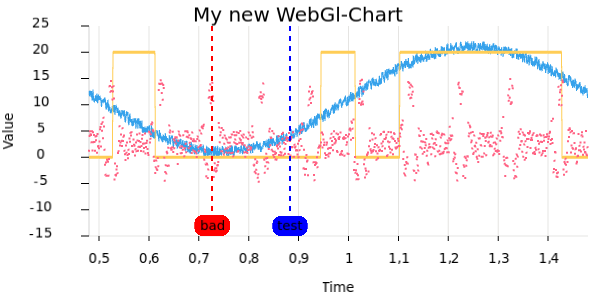

# webgl-chart
High performance web Chart Library to plot line-charts and annotations using WebGL.



## Install
[NPM](https://www.npmjs.com/package/@tomsoftware/webgl-chart)

```bash
npm i @tomsoftware/webgl-chart -save
```

# webgl-chart-vue
Utilize the Vue wrapper to seamlessly integrate the webgl-chart into your Vue application.

## Install
[NPM](https://www.npmjs.com/package/@tomsoftware/webgl-chart-vue)

```bash
npm i @tomsoftware/webgl-chart-vue -save
```

# webgl-chart-react
Use the React wrapper to seamlessly integrate the webgl-chart into your React application."

## Install
[NPM](https://www.npmjs.com/package/@tomsoftware/webgl-chart-react)

```bash
npm i @tomsoftware/webgl-chart-react -save
```

# Documentation
See https://chart.hmilch.net/ for examples and documentation.


# Examples
Explore the [example](./example) folder for basic examples to get you started.
