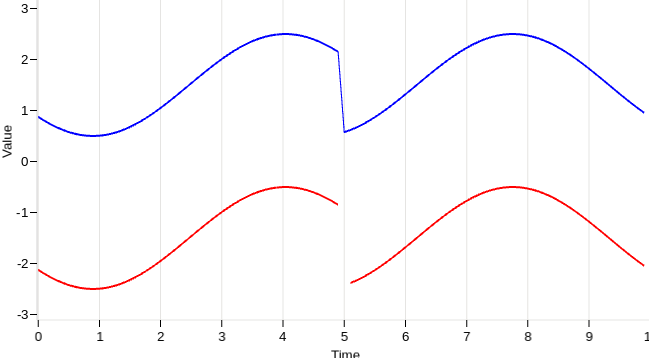

# WebGl-chart
<p align="center">
   
   <br />
</p>

Free high performance web Chart Library to plot line-, bar-, area-, bubble-charts and annotations using WebGL.

 

<table>
  <tr>
    <th>Bubble Chart</th>
    <th>Bar Chart</th>
  </tr>
  <tr>
    <td></td>
    <td></td>
  </tr>

  <tr>
    <th>Area Charts</th>
    <th>Candlestick Chart</th>
  </tr>
  <tr>
    <td></td>
    <td></td>
  </tr>

  <tr>
    <th>Annotations</th>
    <th>Rolling &amp; Sliding Window</th>
  </tr>
  <tr>
    <td></td>
    <td></td>
  </tr>

  <tr>
    <th>Stacked</th>
    <th>Multi axis</th>
  </tr>
  <tr>
    <td></td>
    <td></td>
  </tr>
</table>


## Install

### NPM Packages

| Package | Description
|---|---|
| [@tomsoftware/webgl-chart](https://www.npmjs.com/package/@tomsoftware/webgl-chart) | WebGL chart engine <br> `npm i @tomsoftware/webgl-chart --save` |
| [@tomsoftware/webgl-chart-vue](https://www.npmjs.com/package/@tomsoftware/webgl-chart-vue) | Vue wrapper for chart <br>  `npm i @tomsoftware/webgl-chart-vue --save` |
| [@tomsoftware/webgl-chart-react](https://www.npmjs.com/package/@tomsoftware/webgl-chart-react) | React wrapper for chart <br>  `npm i @tomsoftware/webgl-chart-react --save` |


### UMD Bundles (Browser `<script>` usage)

UMD builds are included in every release and can be used directly in the browser without any bundler.

| Library | Description | Link |
|---------|-------------|------|
| **webgl-lib.umd.js** | Core WebGL utilities | https://chart.hmilch.net/dist/1.1/webgl-lib.umd.js |
| **webgl-chart.umd.js** | WebGL chart engine | https://chart.hmilch.net/dist/1.1/webgl-chart.umd.js |
| **webgl-chart-vue.umd.js** | Vue 3 wrapper (UMD) | https://chart.hmilch.net/dist/1.1/webgl-chart-vue.umd.js |


# Documentation
See https://chart.hmilch.net/ for examples and documentation.


# Examples
Explore the [example](./example) folder or the [Features in the documentation](https://chart.hmilch.net/features/basic.html) for basic examples to get you started.

## Live Examples

| Example | Description | Link |
|---------|-------------|------|
| **Vanilla JS - Demo** | Single‑page HTML example using UMD bundles | https://chart.hmilch.net/dist/1.1/vanilla-js-example.html |
| **Vue 3 - JSFiddle** | Interactive online example using UMD bundles and the Vue wrapper | https://jsfiddle.net/hzk2bry1/ |
| **Vue 3 - Demo** | Single‑page HTML example using UMD bundles | https://chart.hmilch.net/dist/1.1/umd-vue-example.html |


## Basic usage (simplified)

This library is not a config-only chart kit. It exposes a low-level rendering loop where you draw axes, series data and annotations yourself inside WebGL frame callbacks.

That means maximum flexibility for advanced visual controls (custom mark rendering, animated transitions, pixel-perfect overlays), instead of a limited declarative chart config API.

```ts
import { GpuGrowingBuffer, LayoutCell, Color, EventDispatcher } from '@tomsoftware/webgl-lib';
import { SeriesPoint, SeriesBar, SeriesLine, Scale, BasicChartLayout } from '@tomsoftware/webgl-chart';
import { Chart, ChartConfig } from '@tomsoftware/webgl-chart-vue';

// (1) prepare data buffers
const time = new GpuGrowingBuffer('float32', [1, 2, 3]);
const data1 = new GpuGrowingBuffer('float32', [3.1, 4.2, 5.3]);
const data2 = new GpuGrowingBuffer('float32', [1.1, 2.2, 3.3]);
const data3 = new GpuGrowingBuffer('float32', [4, 3, 2]);

// (2) create series objects
const points = new SeriesPoint(time, data1)
  .setColor(Color.blue)
  .setPointSize(4);

const line = new SeriesLine(time, data2)
  .setColor(Color.darkGreen)
  .setThickness(2);

const bars = new SeriesBar(time, data3)
  .setColor(Color.red)
  .setBarWidth(0.02);

// (3) layout and scales
const scaleX = new Scale(0, 10);
const scaleY = new Scale(-10, 20);
const layout = new BasicChartLayout(dispatcher, container, scaleX);

// (4) chart configuration
const config = new ChartConfig().setRenderCallback(ctx => {
  // render loop will be processed every redraw
  ctx.calculateLayout(container);

  layout.draw(ctx);

  points.draw(ctx, scaleX, scaleY, layout.chartCell);
  line.draw(ctx, scaleX, scaleY, layout.chartCell);
  bars.draw(ctx, scaleX, scaleY, layout.chartCell);
});
```

# Build, debug and contribute

## Project structure

This repository monorepo structure:

- `packages/webgl-lib`: core utilities (vector/math, colors, layout, event handling, text rendering).
- `packages/webgl-chart`: chart rendering engine (line, bar, bubble, area, tooltip) depending on `webgl-lib`.
- `packages/webgl-chart-vue`: Vue wrapper for `webgl-chart`.
- `packages/webgl-chart-react`: React wrapper for `webgl-chart`.
- `docu`: VuePress documentation site.


## Contributions Welcome

Any contributions, feedback, or bug reports are welcome. Please open issues or pull requests on GitHub in order to help improve the library, documentation and examples.